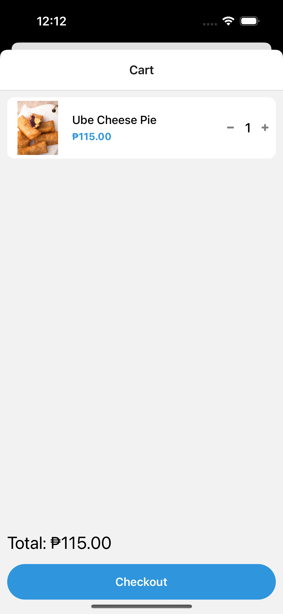

# FoodNinja

Food Delivery App with authentication, real time updates, orders and products management.

## Tech Stack

**Client:** React Native, React Context, Tanstack Query

**Server:** Supabase

## Run Locally

Clone the project

```bash
  git clone <link to my repo >
```

Go to the project directory

```bash
  cd <my-project-name >
```

Install dependencies

```bash
  npm install
```

Start the server

```bash
  npm start
```

## Environment Variables

To run this project, you will need to add the following environment variables to your .env file for supabase if you want to use your own.

`EXPO_PUBLIC_SUPABASE_URL`

`EXPO_PUBLIC_SUPABASE_API_KEY`

## Features

- Cross platform
- Real time updates with tanstack query and supabase
- Authentication
- Push Notifications
- Products and orders management

## Screenshots

<div>





</div>

## Documentation for dependencies

- [Expo](https://docs.expo.dev/)
- [Supabase](https://supabase.com/docs)
- [TanStack Query](https://tanstack.com/query/latest/docs/framework/react/overview)

## Roadmap

- Add online payment methods

- Allow product feedback after delivery

## 🔗 Links

[](https://www.linkedin.com/in/bellkim-keith-onggon-0b6467140/)
